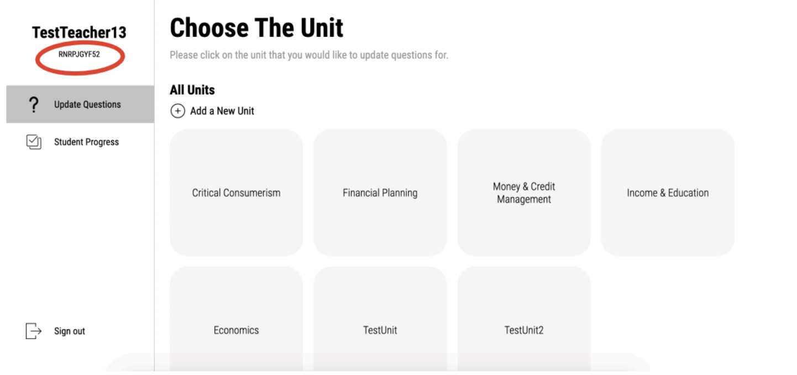

# Teacher Platform FAQs

## Where do I find my class code?

Your class code is located on the left navigation bar under your name.

## Why am I getting errors when registering for an account?

If you are getting registration errors, it is caused by one of the following problems:

1. Your username is already taken.
2. Your password is not strong enough \(must be at least 8 characters\)
3. Your email is invalid

## Why can't I find the page to add questions?

You must have created at least one unit to be able to add questions. Questions are tied to a particular unit.

