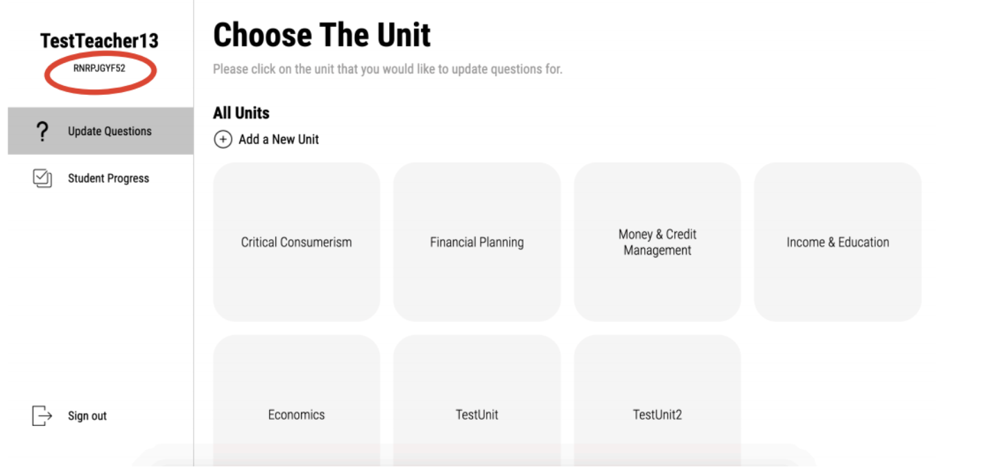

# Parlay Island Teacher Platform

### Creating an Account

* Click on the **register** button.
* Enter your name, email, username, password and click **submit.**

**Make sure your email is valid, your username is unique, and your password is at least 8 characters.**

* Log into your new account with your username and password.



### Class Codes

* When you log into your account, you should see your **class code** under your name in the left navigation bar.
  * You must give this class code to students so they can access questions specific to your class.

### Units and Questions

_You can manage your units and questions by clicking on the "Update Questions" tab._

#### Managing Units

#### **Adding a Unit**

1. Click on the plus button next to the "Add a New Unit" label.  
   1. Enter the name of the unit and click submit.  
   2. You should see the new unit appear under the "All Units" section.

#### Managing Questions

**Adding a Question**

**NOTE: You must create a unit before you can create questions. Questions are linked to a specific unit.**

1. Click on a **unit** that you have created.
2. Click on the **plus button** next to the "Add a Question" label.
3. Enter the name of the question, the answer choices, and click on the radio button that corresponds to the choice that is the correct answer.
4. After clicking submit, you should see your new question under the "Question Bank" section.



**Modifying a Question**

1. Click on a **unit** that you have created.
2. Click on the **question** that you want to update.
3. Next to the question title, click on the **pencil icon** next to the "Modify Question" label. 
4. Change the fields that you want to update.
5. After you click the **Modify** button, you should see the new changes for your question.



**Deleting a Question**

1. Click on a **unit** that you have created.
2. Click on the **red trash icon** next to the question that you want to delete
3. A confirmation pop-up will appear - click **confirm** to delete the question and **cancel** if you do NOT want to delete the question.



#### Understanding Question Statistics

**Question Overall Results**

* The percentage at the right of each question is the overall percentage that the question has been answered correctly across all students.

**Question Choice Specific Results**

* The percentage at the right of each answer choice is the percentage that choice has been chosen across all students.

### Student Progress

_You can see your students' progress by clicking the "Student Progress" tab._

#### Viewing Struggling Students

The students under the "Struggling Students" header are the students who have the lowest overall question accuracy.

#### Viewing All Students

All the students in your class are under the "All Students" header. These students are ordered alphabetically.

#### Viewing A Specific Student's Progress

1. Click on a particular student under the "All Students" header.
2. For every single unit, you will see the questions that the student has answered and what their accuracy for that question was.

**If a student has not answered questions for a particular unit, you will see text that says "This student has no responses for this unit."**

